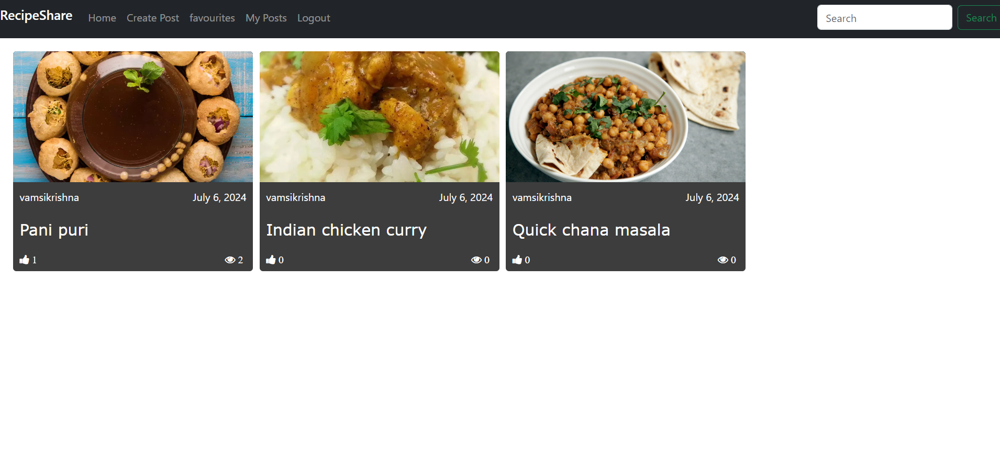
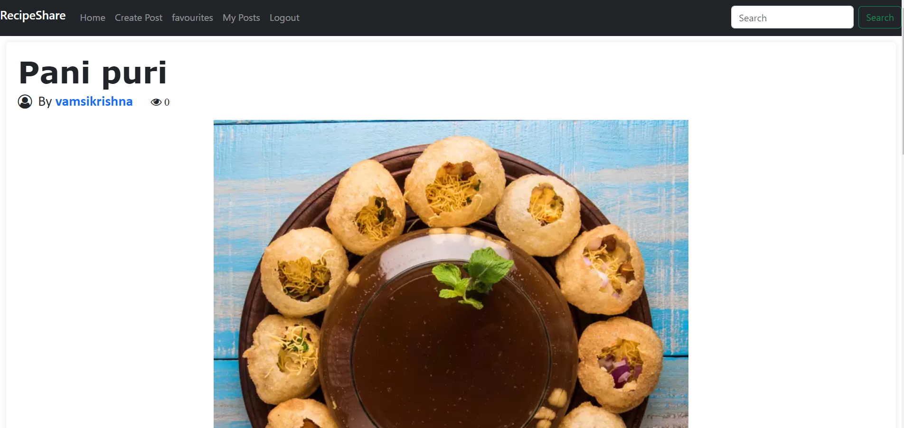
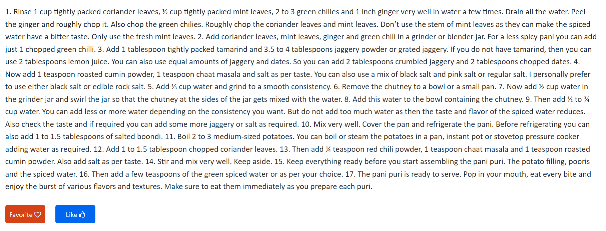
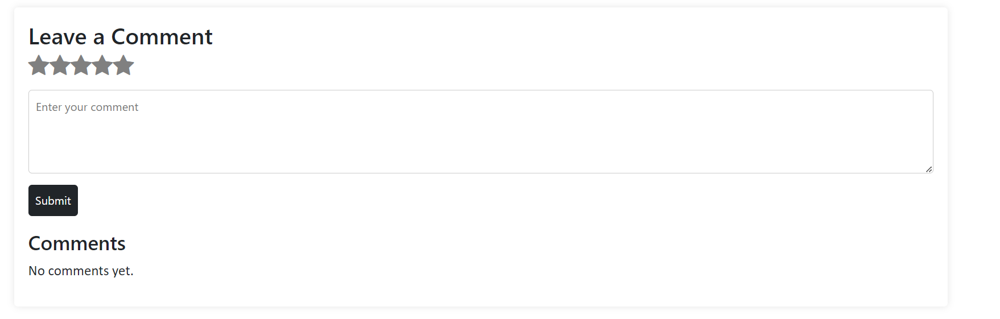
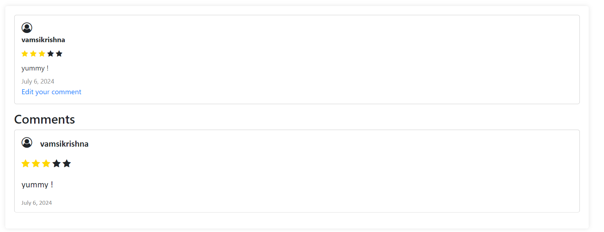
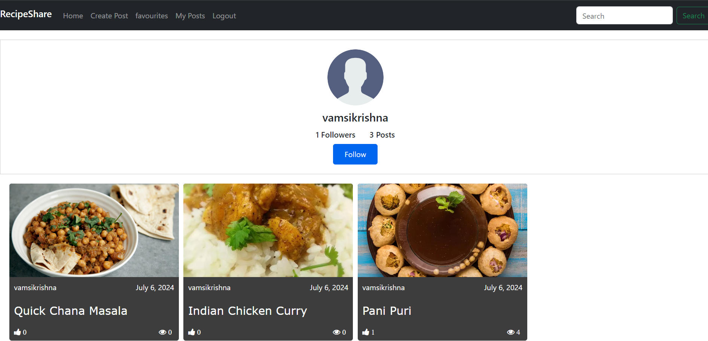

# RecipeShare Project

## Project Overview

RecipeShare is a web application that allows users to share recipes, interact with posts, and connect with authors. Users can create posts, favorite recipes, and explore recipes shared by other users. This project is developed as part of the CS50W final project.

## Distinctiveness and Complexity

RecipeShare distinguishes itself by offering several unique features such as:
- Create, edit, and favorite posts: Users can create new posts, edit existing ones, and favorite posts to keep track of their preferred recipes.
- Comment on recipes: Users can comment on recipes, providing feedback and suggestions.
- Search for recipes: Users can search for recipes based on various criteria.
- Follow authors: Users can follow other authors to keep up with their latest recipes.
- Edit comments: Users can edit their comments, providing flexibility to update their inputs.
- Like and rate posts: Users can like and rate posts, helping others find the best recipes.
- Responsive design: The application is designed to be mobile-responsive, ensuring usability across different devices.

The project integrates Django for backend logic and JavaScript for frontend interactions, ensuring a dynamic and interactive user experience. Additionally, RecipeShare's mobile-responsive design ensures usability across different devices, adding to its complexity.

## Files and Directories

### capstone
- **asgi.py**: ASGI configuration.
- **settings.py**: Configuration settings.
- **urls.py**: URL routing configuration.
- **wsgi.py**: WSGI configuration.

### recipeshare
- **assets**
  - **readme-images**: Contains images for the README documentation.
- **migrations**: Database migrations.
- **static/recipeshare**
  - **index.js**: Main JavaScript file for frontend interactions.
  - **styles.css**: Main CSS file for styling.
- **templates/recipeshare**
  - **createpost.html**: Template for creating a new post.
  - **favorites.html**: Template for viewing favorite posts.
  - **index.html**: Main template showing the feed of posts.
  - **layout.html**: Base layout template extended by other templates.
  - **login.html**: Template for user login.
  - **myposts.html**: Template for viewing posts created by the user.
  - **profile.html**: Template for viewing user profiles.
  - **register.html**: Template for user registration.
  - **searchresult.html**: Template showing search results.
  - **viewpost.html**: Template for viewing a single post.
- **__init__.py**: Initialization file.
- **admin.py**: Admin interface configuration.
- **apps.py**: App configuration.
- **models.py**: Contains models for the project.
  - **UserExtended**: Extends the standard User model.
  - **Post**: Represents posts.
  - **Comment**: Represents user comments.
- **tests.py**: Unit tests.
- **urls.py**: URL routing configuration.
- **views.py**: Contains view functions for rendering templates.

### Project Root
- **db.sqlite3**: Database file.
- **manage.py**: Django’s command-line utility.
- **README.md**: Project documentation.
- **requirements.txt**: List of dependencies for the project.

## How to Run My Application
1. **Clone the repository**:
    git clone https://github.com/me50/vamsi3515/tree/web50/projects/2020/x/capstone

2. **Navigate to the project directory**:
    cd capstone

3. **Install dependencies**:
    pip install -r requirements.txt

4. **Apply migrations**:
    python manage.py migrate

5. **Start the server**:
    python manage.py runserver

6. **Open your browser and go to**: 
    http://localhost:8000

## Additional Information

### Features

- **Create, edit, and favorite posts**:
  Users can create new recipe posts, edit their existing posts, and mark their favorite recipes for easy access. This feature allows users to share their culinary creations and save recipes they love.

- **Comment on recipes**:
  Users can leave comments on recipe posts, providing feedback, asking questions, or sharing their experiences with the recipe. This fosters a community of interaction and engagement around each post.

- **Search for recipes**:
  The search functionality enables users to find specific recipes based on keywords. This helps users quickly locate recipes that match their interests or dietary preferences.

- **Follow authors**:
  Users can follow their favorite recipe authors to stay updated on their latest posts. This feature creates a personalized feed and encourages users to connect with like-minded individuals.

- **Edit comments**:
  Users have the ability to edit their comments on recipe posts, allowing them to correct mistakes or update their feedback as needed.

- **Like and rate posts**:
  Users can like and rate recipe posts, providing valuable feedback to authors and helping other users identify popular and highly-rated recipes.

- **Responsive design**:
  The web application is designed to be fully responsive, ensuring a seamless user experience across various devices, including desktops, tablets, and smartphones.

**Dependencies**:
- Django
- Django REST Framework

**Design**: 
RecipeShare features a clean and intuitive user interface with a focus on usability and a responsive layout, ensuring a seamless experience across different devices.

## Screenshots
Here are some screenshots showcasing the application:

### Home Page

### Recipe Page

### Author Profile

For a live demonstration, check out the [demo on YouTube](https://youtu.be/A7uDKzQbBEQ?si=3YW_M9Aco1XAPGbf).